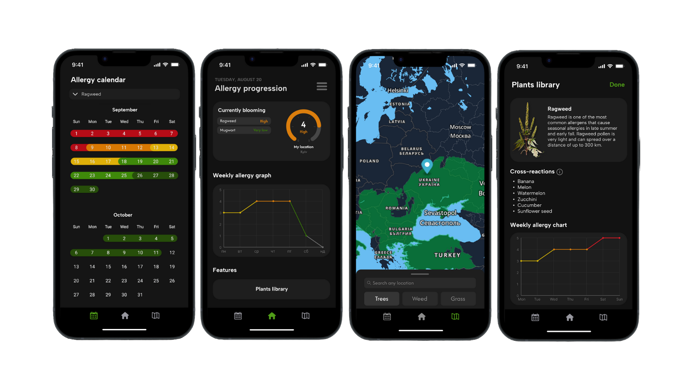
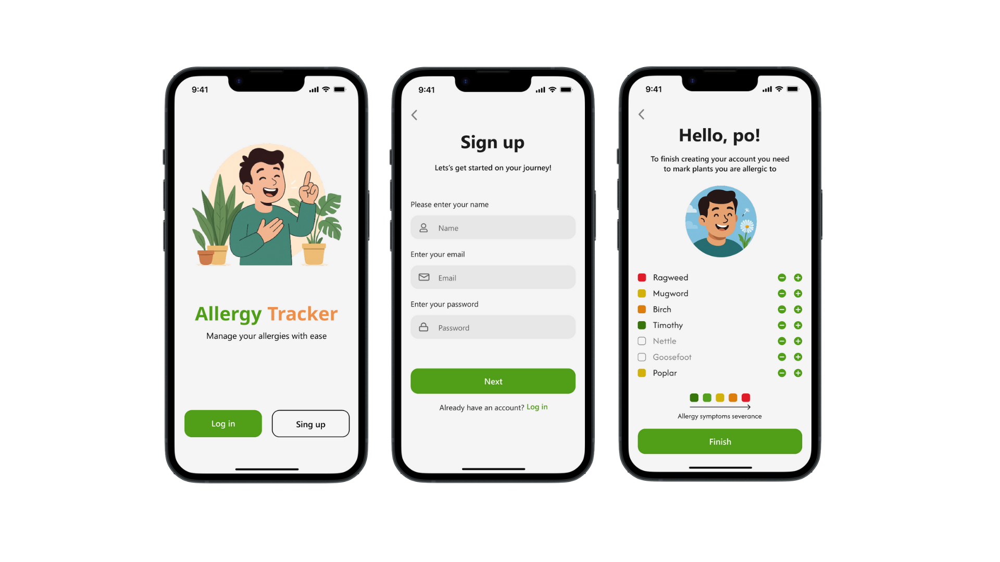

# 🌿 Allergy Tracker

Allergy Tracker is a cross-platform mobile application that predicts and visualizes seasonal allergy periods using machine learning and real-time environmental data.

The project combines two independently deployed machine learning services with live weather and pollen information to generate personalized allergy forecasts.

---

## 📸 Screenshots

### Main Application

The screenshots below showcase the core functionality of the application:

- Home screen
- Allergy calendar
- Interactive pollen map
- Plant library

### Authentication

Example authentication screens.

---

## 🚀 Features

- Personalized allergy forecasts
- Seasonal blooming calendar
- Interactive pollen map
- Plant encyclopedia
- Offline support using cached data

---

## 🤖 Prediction Pipeline

The application generates allergy forecasts through a two-stage machine learning pipeline.

### 📅 Bloom Date Prediction

A **Random Forest Regression** model predicts the beginning and end of each plant's blooming season using historical weather and pollen data.

### 📈 Pollen Intensity Prediction

Using the predicted blooming window, a baseline pollen intensity curve is generated and refined by a second **Random Forest Regression** model using real-time environmental conditions:

- Temperature deviation
- Humidity
- Wind speed
- Cloud cover

The resulting daily intensity values are displayed in the calendar and on the interactive map.

---

## 🏗️ Architecture

The mobile application communicates directly with two independently deployed Flask APIs:

- 📅 **Bloom Date Prediction API** – predicts blooming start and end dates.
- 📈 **Pollen Intensity Prediction API** – predicts daily pollen intensity throughout the blooming period.

Both services expose REST endpoints and are deployed on Render using Gunicorn.

---

## 📡 External Services

- **Open-Meteo** — weather forecasts
- **OpenCageData** — reverse geocoding
- **Breezometer** — pollen data and map layers
- **Mapbox** — interactive maps

---

## 🛠️ Tech Stack

| Layer | Technologies |
|--------|--------------|
| Frontend | React Native CLI |
| Backend APIs | Flask |
| Machine Learning | scikit-learn (Random Forest Regression) |
| Deployment | Render, Gunicorn |
| Maps | Mapbox |
| Weather & Pollen Data | Open-Meteo, Breezometer |
| Geocoding | OpenCageData |
| Offline Storage | AsyncStorage |

---

## 📦 Installation

Download the latest Android APK from the **Releases** section.

---

## 📚 Related Repositories

### 📅 Bloom Date Prediction API

Flask service responsible for predicting blooming start and end dates using machine learning.

`allergy-tracker-bloom-predictor`

### 📈 Pollen Intensity Prediction API

Flask service responsible for generating daily pollen intensity forecasts from environmental conditions.

`allergy-tracker-intensity-predictor`

---

## 📝 Development Notes

This was my first large-scale software project and my first experience with React Native, backend development, machine learning, and deployment. It served as a learning project and laid the foundation for my later work.
